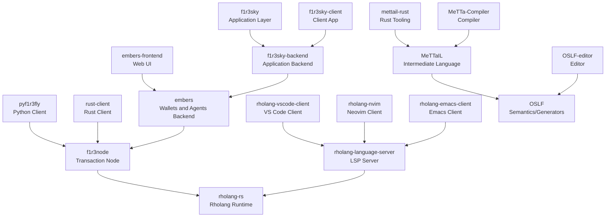

# F1R3FLY.io Cross-Project Dependencies

## Purpose

This document tracks high-level dependencies across key F1R3FLY.io repositories to support:

- impact analysis,
- release coordination,
- documentation-first planning.

Repository names in this document follow canonical org naming reconciled on `2026-02-13`.

## Dependency Map



## Dependency Notes

- The map is intentionally portfolio-level and should be treated as coordination guidance, not build-graph truth.
- Validate dependency details in each repository before implementation planning or release sign-off.
- Some relationships are integration-level (service-to-service), not direct package dependencies.

## Canonical Projects in Scope

| Project | Primary Role | Depends On (High Level) | Dependents (High Level) | Status |
|---|---|---|---|---|
| `f1r3node` | Core transaction node | `rholang-rs` | `pyf1r3fly`, `rust-client`, `embers` | Active |
| `rholang-rs` | Runtime/language execution | - | `f1r3node`, `rholang-language-server` | Active |
| `embers` | Wallets/agents backend | `f1r3node` | `embers-frontend`, `f1r3sky-backend` | Active |
| `embers-frontend` | Web frontend | `embers` | - | Active |
| `f1r3sky-backend` | App backend | `embers` | `f1r3sky`, `f1r3sky-client` | Active |
| `f1r3sky` | Application layer | `f1r3sky-backend` | - | Active |
| `f1r3sky-client` | Web/mobile client | `f1r3sky-backend` | - | Active |
| `rholang-language-server` | LSP server | `rholang-rs` | editor clients | Active |
| `MeTTaIL` | Intermediate language | `OSLF` (semantic tooling alignment) | `mettail-rust`, `MeTTa-Compiler` | Active |
| `OSLF` | Formal tooling/generators | - | `MeTTaIL`, `OSLF-editor` | Active |
| `F1r3bu1ld3r` | Infra visualization tooling | `IaC`/integration context | deployment workflows | Active |
| `system-integration` | Cross-project integration code | multiple project APIs | integration workflows | Active |

## Breaking Change Process

### Required Steps

1. Document the change in the repository changelog.
2. Identify impacted dependent repositories.
3. Publish migration notes in the source repository.
4. Open dependency update issues in affected repositories.
5. Confirm integration tests pass across impacted boundaries.

### Change Categories

- `API Contract`: service schema, RPC contract, REST shape.
- `Runtime Behavior`: consensus/runtime behavior that impacts clients.
- `Tooling Interface`: LSP/editor/protocol behavior.
- `Build/Packaging`: crate/package/module boundaries.

## Release Coordination Order

1. Language/runtime core (`rholang-rs`, `OSLF`, `MeTTaIL`, `MeTTa-Compiler`).
2. Core node/services (`f1r3node`, `embers`).
3. App backends and clients (`f1r3sky-backend`, `f1r3sky`, `f1r3sky-client`, `embers-frontend`).
4. Tooling and integrations (`rholang-language-server` clients, `F1r3bu1ld3r`, `system-integration`).

## Documentation Requirements per Repository

Each repository should maintain:

1. a machine-readable dependency manifest (`dependencies.json` or ecosystem equivalent),
2. a changelog with compatibility notes,
3. migration guidance for breaking changes,
4. interface documentation for external consumers.

## Validation Commands

```bash
# Refresh canonical org repo list
gh api '/orgs/F1R3FLY-io/repos?per_page=100&type=all'

# Find hard-coded repo links in docs
rg -n 'https://github.com/F1R3FLY-io/' docs
```

## Maintenance

- Update this file whenever repositories are renamed, merged, split, or retired.
- Ensure all project names stay aligned with `docs/Organization_of_Repositories.md`.

---

Maintained by the F1R3FLY.io platform team.
