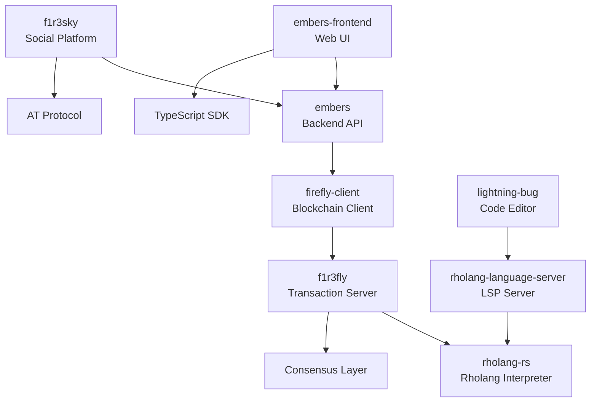

# F1R3FLY.io Cross-Project Dependencies

## Purpose

This document maps dependencies and relationships between F1R3FLY.io projects to facilitate impact analysis, coordinated releases, and ecosystem understanding.

## Dependency Matrix

### Core Platform Dependencies



### Project Dependency Details

| Project | Dependencies | Dependents | API Type | Status |
|---------|--------------|------------|----------|--------|
| **f1r3fly** | rholang-rs | firefly-client, embers | gRPC | Production |
| **rholang-rs** | - | f1r3fly, rholang-language-server | Library | Production |
| **embers** | firefly-client | embers-frontend, f1r3sky | REST/OpenAPI | Active |
| **embers-frontend** | embers API | - | Consumer | Active |
| **firefly-client** | f1r3fly | embers | gRPC Client | Active |
| **f1r3sky** | embers, AT Protocol | - | REST | Development |
| **rholang-language-server** | rholang-rs | lightning-bug | LSP | Active |
| **lightning-bug** | rholang-language-server | - | LSP Client | Development |
| **MeTTa** | - | Research tools | Library | Research |
| **F1r3bu1ld3r** | - | - | Standalone | Development |

## Version Compatibility Matrix

### Current Versions (as of 2025-01)

| Project | Version | Min f1r3fly | Min rholang-rs | Min embers |
|---------|---------|-------------|----------------|------------|
| f1r3fly | 1.0.0 | - | 0.5.0 | - |
| rholang-rs | 0.5.0 | - | - | - |
| embers | 0.3.0 | 1.0.0 | - | - |
| embers-frontend | 0.3.0 | - | - | 0.3.0 |
| firefly-client | 0.2.0 | 1.0.0 | - | - |
| f1r3sky | 0.1.0 | - | - | 0.3.0 |

## API Contracts

### Inter-Service Communication

```yaml
# f1r3fly <-> firefly-client
protocol: gRPC
port: 50051
authentication: mTLS
contracts:
  - f1r3fly.proto
  - consensus.proto
  - blockchain.proto

# embers <-> embers-frontend
protocol: REST/OpenAPI 3.0
port: 4000
authentication: JWT Bearer
contracts:
  - openapi.yaml
  - websocket-events.md

# rholang-language-server <-> lightning-bug
protocol: LSP over WebSocket
port: 7000
authentication: None (local only)
contracts:
  - LSP 3.17 specification
```

## Breaking Change Policy

### Versioning Strategy

All projects follow Semantic Versioning 2.0.0:
- **MAJOR**: Breaking API changes
- **MINOR**: Backward-compatible functionality
- **PATCH**: Backward-compatible fixes

### Deprecation Timeline

1. **Announcement** (T+0): Document deprecation in CHANGELOG
2. **Warning** (T+1 month): Add deprecation warnings
3. **Migration** (T+3 months): Provide migration guide
4. **Removal** (T+6 months): Remove deprecated feature

### Breaking Change Checklist

- [ ] Update version compatibility matrix
- [ ] Document in CHANGELOG.md
- [ ] Create migration guide
- [ ] Update dependent projects
- [ ] Notify ecosystem partners
- [ ] Update CI/CD pipelines

## Shared Libraries and Components

### Shared TypeScript Packages
```json
{
  "@f1r3fly/client": "Wallet and agent operations",
  "@f1r3fly/types": "Shared TypeScript types",
  "@f1r3fly/utils": "Common utilities"
}
```

### Shared Rust Crates
```toml
[workspace.dependencies]
firefly-client = { path = "../firefly-client" }
firefly-types = { path = "../firefly-types" }
firefly-macros = { path = "../firefly-macros" }
```

### Shared Protocol Definitions
```
protos/
├── blockchain.proto    # Blockchain operations
├── consensus.proto     # Consensus protocols
├── agent.proto         # AI agent definitions
└── wallet.proto        # Wallet operations
```

## Release Coordination

### Release Train Schedule

| Phase | Duration | Activities |
|-------|----------|------------|
| Planning | Week 1 | Dependency analysis, version planning |
| Development | Weeks 2-3 | Feature development, testing |
| Integration | Week 4 | Cross-project testing |
| Release | Week 5 | Coordinated deployment |

### Release Order

1. **Core Libraries** (rholang-rs, firefly-types)
2. **Platform Services** (f1r3fly, firefly-client)
3. **Application APIs** (embers)
4. **Frontend Applications** (embers-frontend, f1r3sky)
5. **Developer Tools** (rholang-language-server, lightning-bug)

## Integration Testing

### Cross-Project Test Suites

```bash
# Run integration tests across projects
./scripts/cross-project-tests.sh

# Test specific dependency chain
./scripts/test-dependency.sh embers embers-frontend

# Validate API contracts
./scripts/validate-contracts.sh
```

### Test Matrix

| Test Suite | Projects Tested | Frequency |
|------------|----------------|-----------|
| Core Integration | f1r3fly + firefly-client | Every commit |
| API Integration | embers + embers-frontend | Every commit |
| Full Stack | All projects | Nightly |
| Performance | Critical path projects | Weekly |

## Monitoring and Health

### Service Dependencies Dashboard

```yaml
health_checks:
  - name: f1r3fly_health
    url: http://f1r3fly:50051/health
    critical: true

  - name: embers_health
    url: http://embers:4000/health
    critical: true

  - name: frontend_health
    url: http://embers-frontend:3000/health
    critical: false
```

### Dependency Alerts

- Version mismatch detection
- API contract violations
- Performance degradation
- Security vulnerability propagation

## Migration Guides

### Standard Migration Template

```markdown
# Migration Guide: [Project] v[OLD] to v[NEW]

## Breaking Changes
- List all breaking changes
- Explain impact on dependent projects

## Migration Steps
1. Update dependencies
2. Modify configuration
3. Update code
4. Test integration

## Rollback Procedure
- Steps to rollback if needed
```

## Documentation Requirements

Each project MUST maintain:

1. **dependencies.json** - Machine-readable dependency list
2. **CHANGELOG.md** - Version history with breaking changes
3. **MIGRATION.md** - Migration guides for major versions
4. **API.md** - API documentation and contracts

## Tools and Automation

### Dependency Management Tools

```bash
# Check for outdated dependencies
cargo outdated                    # Rust projects
npm outdated                      # TypeScript projects

# Analyze dependency graph
cargo tree                        # Rust projects
npm ls                           # TypeScript projects

# Security audit
cargo audit                      # Rust projects
npm audit                        # TypeScript projects
```

### CI/CD Integration

```yaml
# GitHub Action for dependency checks
name: Dependency Check
on: [push, pull_request]
jobs:
  check:
    steps:
      - uses: actions/checkout@v3
      - name: Check dependencies
        run: ./scripts/check-dependencies.sh
      - name: Validate contracts
        run: ./scripts/validate-contracts.sh
```

## Best Practices

1. **Loose Coupling**: Minimize direct dependencies
2. **Contract Testing**: Validate API contracts in CI
3. **Version Pinning**: Pin major versions in production
4. **Gradual Rollout**: Use feature flags for breaking changes
5. **Documentation**: Keep dependency docs current
6. **Monitoring**: Track cross-service metrics
7. **Communication**: Coordinate releases across teams

---

*This document is maintained by the F1R3FLY.io platform team. Updates require cross-project coordination.*