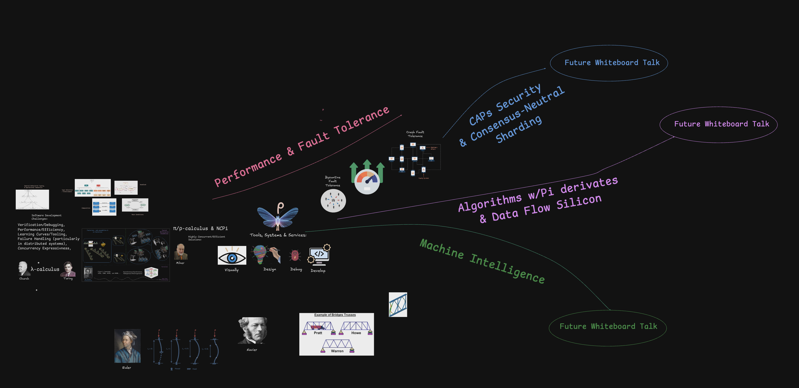

# Whiteboard Talk Diagram Documentation

## Overview

This diagram illustrates a paradigm shift in distributed computing, aligned with F1R3FLY-io's mission to build high-throughput distributed computing systems leveraging decentralizion via Rholang. The visual representation employs manufacturing metaphors and engineering analogies to contrast traditional lambda calculus limitations (left side) with the capabilities of mobile process calculi and channel-process programming (center-right), culminating in Byzantine fault tolerance objectives (upper-right). The firefly-like butterfly image serves as the F1R3FLY-io brand symbol, representing autonomous, emergent agents in blockchain ecosystems such as F1r3node and F1R3FLYFS.

### Diagram Structure

The whiteboard is organized into several key regions:

- **Left Side**: Lambda calculus foundations and traditional functional programming challenges (as they also apply to Rho-caculus systems)
- **Center**: A factory metaphor comparing traditional assembly line (highly sequential) approaches comparing von Neumann machines the opportunity to evolve to new data flow silicon with a flexible and more dynamic "workstation assembly" paradigm
- **Lower Right**: A metaphor for correct by construction software development as structural integrity was insured through the math of Euler and Navier
- **Center Right**: Tools, Systems & Services ecosystem for visual design, debugging, and development using Rho-based mobile process calculi throughout
- **Upper Right**: Byzantine fault tolerance architecture with the efficiency of current state of the art crash fault tolerant systems

## Central Metaphor: Manufacturing Factory and Workstation Assembly

At the core, manufacturing analogies illustrate the evolution of data flow architectures beyond traditional sequential systems. "Factory" approaches depict structured data flows via conveyor icons, representing object factories (inspired by Gamma et al., 1994 patterns) where functional templates drive instance creation like production lines processing inputs in a data-driven manner. This supports emerging data flow models where computation activates based on data availability, moving past von Neumann bottlenecks. In contrast, "workstation assembly" shows distributed data flows as linked desks in adaptive pipelines, analogizing cluster computing where components dynamically assemble outputs. This enables flexible, heterogeneous data processing, optimizing for high-throughput distributed systems like F1R3FLY-io's Interacting Trie Maps in [`itm`](https://github.com/F1R3FLY-io/itm) and Rust/Scala hybrids in [`rust-client`](https://github.com/F1R3FLY-io/rust-client), emphasizing channel-based mobility over rigid sequencing.

## Left Side: Limitations of Traditional Lambda Calculus and Functional Programming

The left indicates limitations of Church's λ-calculus (1930s) in functional programming—stateless, referentially transparent functions enabling purity in languages like Haskell or Scala's MeTTa ([`MeTTa`](https://github.com/F1R3FLY-io/MeTTa) repo)—for modern fault-tolerant distributed computing. It lists von Neumann/Turing-derived constraints: composition challenges, deadlocks, race conditions, type error detection, verification inefficiencies, performance bottlenecks, distributed failure handling, concurrency expressiveness gaps, spatial behavioral typing deficits, and operational semantics limitations. These underscore sequential vulnerabilities in shared-state models, necessitating a new paradigm via mobile process calculi and channel-process programming to enable dynamic, composable interactions that address scalability and resilience in distributed environments.

## Center-Right: Mobile Process Calculi Description

Nearest the center-right, mobile process calculi like Milner's π-calculus (1989) and rho-calculus extensions (core to Rholang in [`rhoHDC`](https://github.com/F1R3FLY-io/rhoHDC) and [`rholang-rs`](https://github.com/F1R3FLY-io/rholang-rs)) are depicted as migrating agents in nested ambients (Cardelli, 1998). Processes as first-class entities, with channels for communication and mobility, enable topology reconfiguration and data flow-driven execution—surpassing static structures by supporting channel-process programming for asynchronous, location-independent concurrency. This new model evolves data architectures for unbounded dynamism, though with nondeterministic verification needs, directly aiding F1R3FLY-io's decentralized platforms as in the MeTTaCycle Yellow Paper ([`MeTTaCycleYellowPaper`](https://github.com/F1R3FLY-io/MeTTaCycleYellowPaper)).

## Correctness by Construction: Bridge Truss Engineering Analogy

The lower-right section draws an engineering analogy from structural analysis of bridge trusses (Pratt, Howe, and Warren designs) to illustrate the "correctness by construction" paradigm. Just as engineers evolved from ad-hoc bridge building to mathematically verifiable truss designs using Euler's beam theory and Navier's tension/compression principles, software engineering can evolve from post-hoc testing to inherently correct systems through formal methods.

Bridge trusses demonstrate visual verification—engineers can verify structural integrity through mathematical models before construction, identifying potential failure modes like buckling through analysis rather than trial and error. Similarly, F1R3FLY-io's approach using rho-calculus and channel-process programming enables formal verification of concurrent systems, addressing λ-calculus limitations (composition challenges, type errors, race conditions) through mathematical foundations rather than runtime debugging.

This paradigm shift—from reactive bug fixing to proactive correctness—parallels the visual Infrastructure-as-Code tools in [`F1r3bu1ld3r`](https://github.com/F1R3FLY-io/F1r3bu1ld3r), where distributed systems are designed with verifiable correctness properties from the ground up, much like bridges are designed with proven load distribution patterns.

## F1R3FLY-io's Tools, Systems, and Services Intent

Upper sections introduce "Tools, Systems & Services" icons: eye for visual inspection, lightbulb/hand for design, bug for debugging, gear/code/monitor for development. These intend to provide an ecosystem for channel-process oriented concurrency—visually designing, verifying, and deploying rho-calculus-based systems to support evolving data flow architectures. In F1R3FLY-io context, this aligns with Rholang LSP ([`rholang-language-server`](https://github.com/F1R3FLY-io/rholang-language-server)), MeTTa intermediate language ([`MeTTaIL`](https://github.com/F1R3FLY-io/MeTTaIL)), and decentralized agents ([`embers`](https://github.com/F1R3FLY-io/embers)), offering services for high-performance distributed apps under documentation-first governance (`.github` templates).

## Objective: Byzantine Fault Tolerance with Crash Fault Efficiency

The upper-right culminates in fault tolerance: network diagrams and gauges demonstrate achieving Byzantine fault tolerance (resilience to arbitrary/malicious failures) with the performance and efficiencies of simpler crash fault tolerance (handling node crashes). This objective harnesses mobile process calculi and channel-process programming for multi-consensus in RNode-derived systems ([`f1r3node`](https://github.com/F1R3FLY-io/f1r3node)), enabling scalable, secure blockchains like f1r3sky ([`f1r3sky`](https://github.com/F1R3FLY-io/f1r3sky))—delivering high-throughput transactions without compromising speed, as in F1R3FLYFS distributed storage, by evolving data flows for inherent efficiency in distributed paradigms.

## Relation to F1R3FLY-io Projects

The diagram informs active repos: [`rhoHDC`](https://github.com/F1R3FLY-io/rhoHDC) for rho encoding in hyper-dimensional computing, [`MeTTa`](https://github.com/F1R3FLY-io/MeTTa) for concurrent languages, [`F1R3FLYFS`](https://github.com/F1R3FLY-io/F1R3FLYFS) for fault-tolerant storage, and [`embers`](https://github.com/F1R3FLY-io/embers) for agents. It advocates transitioning from λ-based sequential limits to mobile concurrency under Apache 2.0, with LLM-assisted workflows (`CLAUDE.md`).

## Usage in Development

Leverage for onboarding: visualize paradigm shifts per ADRs in [`.github/docs/architecture`](https://github.com/F1R3FLY-io/.github/tree/master/docs/architecture). Align contributions with conventional commits and [FLIPs (`fflip`)](https://github.com/F1R3FLY-io/fflip). Contact f1r3fly.ceo@gmail.com or visit https://f1r3fly.io.

## References

- F1R3FLY-io Organization: Rho-calculus-driven distributed systems.
- Key Repos: [`rhoHDC`](https://github.com/F1R3FLY-io/rhoHDC), [`lightning-bug`](https://github.com/F1R3FLY-io/lightning-bug), [`MeTTa`](https://github.com/F1R3FLY-io/MeTTa), [`rholang-rs`](https://github.com/F1R3FLY-io/rholang-rs), [`MeTTaCycleYellowPaper`](https://github.com/F1R3FLY-io/MeTTaCycleYellowPaper), [`f1r3node`](https://github.com/F1R3FLY-io/f1r3node).

## Action Items (from Office Hours)

- **Factory Metaphor**: Mike says that many people may not understand factory assembly versus flexible workstations. Pi/Rho allow for self-assembly  dynamicism, flexibility, and ephemeral activity. Seek out other potential metaphors. Perhaps a traditional personal computer to Internet transition might be useful.
- **Software Development Challenges **: Lambda calculus approaches using functional programming  are inherently single machine (perhaps with shared memory) oriented. Therefore, the challenges for software engineering may be different particularly under deadlock, race conditions, and parallel programming paradigmes [per Mike].
- **Opening**: Need to better desribe factory metaphors if we use that approach. Probably should go through the differences in needs between data flow and von Neumann silicon along with approaches to parallelism.

